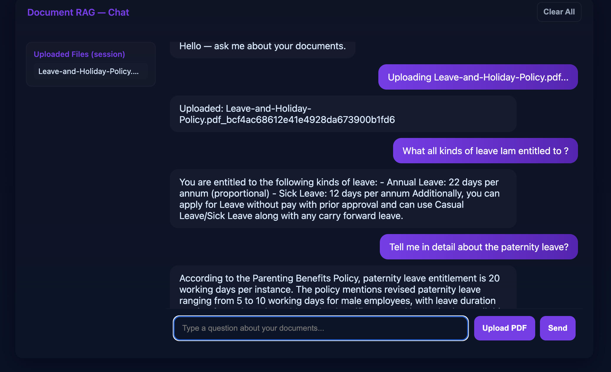

**Enterprise Document Intelligence — RAG**

- **Project Scope**: Build a Retrieval-Augmented Generation (RAG) system for enterprise document intelligence. The project ingests documents, embeds them into a vector store (Chroma), and uses an LLM (via OpenAI / Azure OpenAI) to answer user queries grounded in the retrieved documents.
- **Primary Use Cases**: semantic search over documents, chat-driven Q&A over private corpora, and document ingestion pipelines for knowledge indexing.

**Key Features**
- **Document ingestion**: Add PDFs / text to the Chroma vectorstore.
- **Similarity search**: Retrieve relevant passages for a user query.
- **RAG chat**: Augment LLM prompts with retrieved context to produce grounded answers.
- **Web UI + API**: FastAPI backend with a React frontend (in `ui/`).

**Architecture (high level)**
- **Frontend**: `ui/` — simple React app that calls the backend API.
- **Backend**: FastAPI app defined in `start.py` exposing `/api/chat` and using `main.py` logic.
- **Embedding model**: OpenAI/Azure OpenAI embeddings (configured via env vars).
- **Vector DB**: Chroma (local DB stored under `chromadb_data/`).

**Tech Stack**
- **Language**: Python 3.11+ (project uses modern typing and langchain components).
- **Backend**: FastAPI, Uvicorn.
- **Vector DB**: Chroma (via `langchain_chroma`).
- **LLM & Embeddings**: OpenAI / Azure OpenAI (via `langchain_openai`).
- **Frontend**: Node.js / React (inside the `ui/` folder).

**Prerequisites**
- Install Python 3.11 or later.
- Node.js (v16+/18+ recommended) and `npm` for the frontend.
- Git (to clone the repo).

**Setup (local development)**
1. Create and activate a Python virtual environment:

	python -m venv .venv
	source .venv/bin/activate

2. Install Python dependencies:

	pip install -r requirements.txt

3. Install frontend dependencies (optional if you only run the backend):

	cd ui
	npm install

4. Add runtime environment variables. Create a `.env` in the project root with the following (example keys — do not commit secrets):

	AZURE_OPENAI_ENDPOINT="https://<your-azure-endpoint>/openai/v1/"
	AZURE_OPENAI_KEY="<your-azure-openai-key>"
	OPENAI_EMBEDDING_MODEL="text-embedding-3-small"
	OPENAI_CHAT_MODEL="gpt-4.1-mini"

	Note: the code reads env vars with `python-dotenv`.

**Run (development)**
- Start the backend (FastAPI):

  uvicorn start:app --reload --port 8000

- Start the frontend (from `ui/`):

  cd ui
  npm run dev

- A convenience script is available: run `./run.sh` to start the backend and then the frontend development server.

**API usage**
- POST `/api/chat` — accepts JSON: `{ "question": "..." }` and returns `{ "reply": "..." }`.

**CLI / local interaction**
- The `main.py` file contains helper functions to upload documents and to run an interactive CLI. To try the interactive CLI, you can run `python main.py` (uncomment the `if __name__ == "__main__": main()` guard in `main.py` if you want the menu to run on execution) or call functions from a Python REPL.

**Data**
- Chroma DB data is stored under `chromadb_data/` and `data/` — you can reset the collection via the `clear_database()` function in `main.py`.

**Notes & Next Steps**
- Do not commit secrets. Keep your `.env` out of source control (add to `.gitignore`).
- Add tests for ingestion and retrieval workflows.
- Consider adding docker-compose for a reproducible dev environment.

**Contributing**
- Open issues / PRs with clear descriptions. Use the existing code style and add tests for new features.

**License**
- Add your preferred license (e.g., MIT) or organization's license file.

